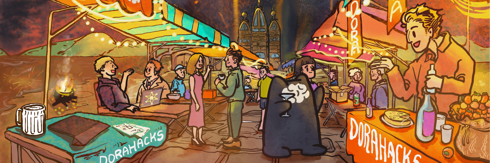

  

## **About DoraHacks**

<a href="https://dorahacks.io/" target="_blank">DoraHacks</a> is the leading global hackathon community and open source developer incentive platform. DoraHacks provides toolkits for anyone to organize hackathons and fund early-stage ecosystem startups.

  

<a href="https://dorahacks.io/" target="_blank">DoraHacks</a> creates a global hacker movement in Web3, AI, Quantum Computing and Space Tech. So far, more than 30,000 startup teams from the DoraHacks community have received over $300M in funding, and a large number of open source communities, companies and tech ecosystems are actively using DoraHacks together with its BUIDL AI capabilities for organizing hackathons and funding open source initiatives.

  <!-- Hackathon Organizer Guide Column -->
  

    <h2>Hackathon Organizer’s Guide</h2>
    <ul>
      <li>
        <a href="https://dorahacks.io/blog/guides/how-to-create-a-hackathon/" target="_blank">
          🏗 Create a Hackathon on DoraHacks
        </a>
      </li>
      <li>
        <a href="https://dorahacks.io/blog/news/hackathon-operation/" target="_blank">
          ⚙️ Hackathon Operations Guide
        </a>
      </li>
      <li>
        <a href="https://dorahacks.io/blog/news/hackathon-prep/" target="_blank">
          🧱 Step Zero: Before You Start
        </a>
      </li>
      <li>
        <a href="https://dorahacks.io/blog/guides/diy-your-hackathon/" target="_blank">
          🧰 Manage Your DIY Hackathon
        </a>
      </li>
      <li>
        <a href="https://dorahacks.io/blog/guides/host-your-own-hackathons/" target="_blank">
          📋 Organizer Prep Checklist
        </a>
      </li>
    </ul>
  

  <!-- Hacker Guide Column -->
  

    <h2>Hacker’s Guide</h2>
    <ul>
      <li>
        <a href="https://dorahacks.io/blog/news/hacker-success-guide/" target="_blank">
          🚀 The Beginner Hacker's Guide
        </a>
      </li>
    </ul>
  

  <!-- Hackathon Ideas Column -->
  

    <h2>Hackathon Ideas</h2>
    <ul>
      <li>
        <a href="https://dorahacks.io/blog/news/start-up-ideas-pt1-2026/" target="_blank">
          💡 DoraHacks Start-up Ideas 2026: Digital Finance
        </a>
      </li>
      <li>
        <a href="https://dorahacks.io/blog/news/ai-trading-hackathon/" target="_blank">
          🤖 AI Trading Hackathon Blueprint
        </a>
      </li>
      <li>
        <a href="https://dorahacks.io/blog/announcements/organize-x402-hackathon/" target="_blank">
          🌐 Organizing an x402 Hackathon
        </a>
      </li>
      <li>
        <a href="https://dorahacks.io/blog/news/hackathons-devrel-super-tool/" target="_blank">
          📣 Hackathons as a DevRel Super Tool
        </a>
      </li>
      <li>
        <a href="https://dorahacks.io/blog/news/hackathon-reimagined/" target="_blank">
          🔄 From Grants to Growth
        </a>
      </li>
    </ul>
  

  <!-- Features Column -->
  

    <h2>Features</h2>
    <ul>
      <li>🚩 <a href="{{ '/features/hackathon/' | relative_url }}">Hackathon</a></li>
    <li>🤖 <a href="{{ '/features/hackathon-ai/' | relative_url }}">Hackathon AI</a></li>
      <li>🧠 <a href="{{ '/features/devrel-ai/' | relative_url }}">DevRel AI</a></li>
      <li>📦 <a href="{{ '/features/buidl/' | relative_url }}">BUIDL</a></li>
      <li>👤 <a href="{{ '/features/hacker-profile/' | relative_url }}">Hacker Profile</a></li>
      <li>🏛️ <a href="{{ '/features/organization-profile/' | relative_url }}">Organization Profile</a></li>
    </ul>
  

  <!-- About Column -->
  

    <h2>About DoraHacks</h2>
    <ul>
      <li>🧭 <a href="{{ '/about/mission-and-vision/' | relative_url }}">Mission and Vision</a></li>
      <li>🧑‍💻 <a href="{{ '/about/who-uses-dorahacks/' | relative_url }}">Who uses Dorahacks.io?</a></li>
      <li>❓ <a href="{{ '/about/why-dorahacks/' | relative_url }}">Why DoraHacks?</a></li>
      <li>📚 <a href="{{ '/about/glossary/' | relative_url }}">Glossary</a></li>
      <li>📨 <a href="{{ '/about/contact-us/' | relative_url }}">Contact Us</a></li>
      <li>🐞 <a href="{{ '/about/bug-reporting/' | relative_url }}">Bug Reporting</a></li>
    </ul>
  

